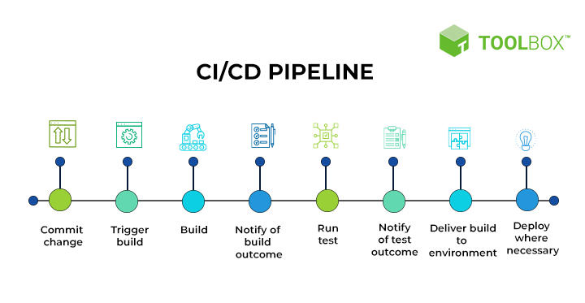

## Docker

### Why Docker is Fast? 

- Docker uses the kernel of the host machine. It doesn't need to create a new kernel for each container. This makes Docker lightweight and fast.
- If we run a command, it's just a process running on the host machine. It doesn't need to create a new kernel for each command.
- Docker Containers are just processes running on the host machine. They are not virtual machines. They are lightweight and fast.

---

## Namespaces

***Namespaces are a feature of the Linux kernel that partitions kernel resources such that one set of processes sees one set of resources while another set of processes sees a different set of resources.***

You can read more about namespaces [here](https://www.nginx.com/blog/what-are-namespaces-cgroups-how-do-they-work/).

---

## Kernal

- The kernel is the core of the operating system. It is responsible for managing the resources of the system and for communicating with the hardware.
- In simple words the kernel is the interface between the hardware and the software.
- The kernel is responsible for managing the resources of the system such as the CPU, the memory, the disk, etc.

---

## Jenkins

### What is CI/CD?

- CI/CD stands for Continuous Integration and Continuous Delivery/Deployment.


- Continuous Integration is the practice of merging code changes into a central repository several times a day. It is used to detect bugs early in the development cycle.
- Continuous Delivery is the practice of deploying code changes into a production environment. It is used to deliver code changes to the users.

**CI/CD Process Example**


Developer commit code in GitHub -> Pull the code from GitHub -> Build the code -> Test the code -> Deploy the code to the Dev environment -> Test the code in the Dev environment -> Deploy the code to the QA environment -> Test the code in the QA environment -> Deploy the code to the Production environment

### What is Jenkins?

- Jenkins is an open-source automation tool written in Java. It is used to automate the CI/CD process.

**Jenkins Installation**

- Install Java
- Install Libraries
- Install Jenkins

**After installing Jenkins, Follow the below steps:**

- Now Jenkins is installed and running on port 8080. To access Jenkins, open the following URL in a browser.
```
http://<ec2-instance-public-ip>:8080
```
- To get the initial admin password, run the following command.
```
sudo cat /var/lib/jenkins/secrets/initialAdminPassword
```


- Install the suggested plugins.


- Create an admin user.


- Jenkins is now ready to use.


### Jenkins Terminologies

- **Jenkins Job** - What work you want to do in Jenkins is called a Jenkins Job. It can be a build job, a test job, a deployment job, etc.
- **Jenkins Pipeline** - A Jenkins Pipeline is a collection of Jenkins Jobs. It is used to organize Jenkins Jobs into stages.
- **Master** - The Jenkins Master is the main Jenkins server. It is responsible for managing the Jenkins Jobs and the Jenkins Agents.
- **Worker/Agent** - The Jenkins Worker/Agent is a machine that is responsible for running Jenkins Jobs. It is connected to the Jenkins Master.


