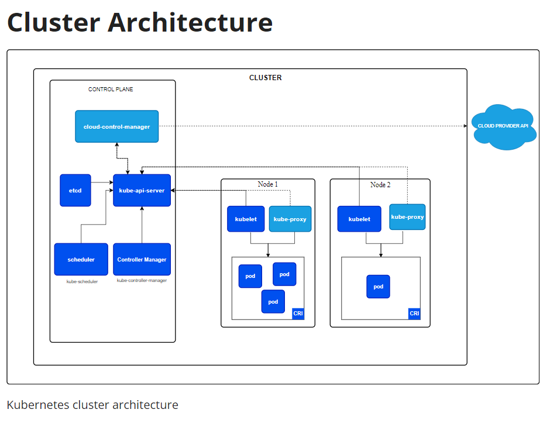

## Kubernetes Architecture

**Architecture of Kubernetes**

- **Master Node**
    - The master node/control plane is responsible for managing the Kubernetes cluster.
    - The master node consists of the following components:
        - **API Server**
            - The API server is responsible for serving the Kubernetes API.
            - It is used for communication between the master node and the worker nodes, users, and external clients.
        - **Scheduler**
            - The scheduler is responsible for scheduling the applications on the worker nodes.
            - It is responsible for taking the decision about the placement of the pods at nodes.
        - **Controller Manager**
            - The controller manager is responsible for managing the controllers.
            - It is responsible for managing the replication controller, endpoints controller, namespace controller, and service accounts controller.
        - **etcd**
            - etcd is a distributed key-value DB used to store the cluster state.
            - It is used by the master node to store the cluster state.

- **Worker Node**

    - The worker node is responsible for running the applications.
    - It consists of the following components:
        - **Kubelet**
            - The kubelet is the k8s agent, It is used to communicate with the master node, It will get all the information from the master node and it will run the containers.
            - It is responsible for managing the containers on the worker node.
        - **Kube Proxy**
            - The kube proxy is responsible for managing the network on the worker node.
            - It is responsible for routing the traffic to the containers.
        - **Container Runtime**
            - The container runtime is responsible for running the containers.
            - It is responsible for managing the containers on the worker node.
