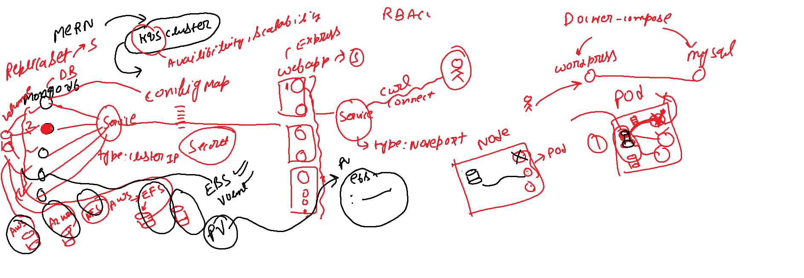

## Mern Application on Kubernetes

**Objective:**

- To deploy a Mern application using K8S components like pods, deployments, services, etc.

### What is Mern?

- MERN is a full-stack JavaScript solution that helps you build fast, robust, and maintainable production web applications using MongoDB, Express, React, and Node.js.

### Our Mern Application

- We are going to use the below images for our Mern application.

  - **Fronted/Backend:** `mongo-express:latest`
  - **Database:** `mongo:5.0`

- mongo-express is a web-based MongoDB admin interface written with Node.js, Express, and Bootstrap3.
- mongo is a document database, which means it stores data in JSON-like documents.

**Architecture of our Mern Application**

**Architecture Diagram:**



- We are going to Create two deployments one for the application(frontend/backend) and one for the database.

**Frontend/Backend Deployment:**

- We are using the `mongo-express:latest` image for creating the application.
- We use deployment to create the pods because if the pod goes down, the deployment will create a new pod, Deployment will help us manage the lifecycle of the pod
- for exposing the frontend/backend to the outside world, we are using the service with `NodePort` Type.
- **Nodeport:** It is a service that exposes the deployment outside the cluster.

**Database Deployment:**

- We are creating a deployment for the database.
- We are using the `mongo:5.0` image.
- We use deployment to create the pods because if the pod goes down, the deployment will create a new pod.
- for communication of DB with the frontend/backend, we are using the `ClusterIP` service.
- **ClusterIP:** It is a service type that exposes the deployment within the cluster.
- **Secrets:** We are using the secrets feature to store sensitive information like `username` and `password`.
- **ConfigMap:** We are using ConfigMap to store the non-sensitive data in key-value pairs, In our case we are using it to store the database URL.
- **PersistentVolume and PersistentVolumeClaim:** We are using PV and PVC to store the data in the database, So that if our pod goes down, the data will be safe.

### Steps to deploy Mern Application on Kubernetes

1. **Create a Deployment for MongoDB**

- Create a file named `mongo-app.yaml` and add the below content.

```yaml

apiVersion: apps/v1
kind: Deployment
metadata:
  name: mongo-deployment
  labels:
    dc: mumbai
    env: prod
    app: mongo
spec:
  replicas: 1
  selector:
    matchLabels:
      app: mongo
  template:
    metadata:
      name: mongodb
      labels:
        app: mongo
    spec:
      containers:
      - name: mongo-db
        image: mongo:5.0
        ports:
        - containerPort: 27017
        volumeMounts:
        - mountPath: /data/db
          name: mongo-volume
        env:
        - name: MONGO_INITDB_ROOT_USERNAME
          valueFrom:
            secretKeyRef:
              name: mongo-secret
              key: mongo-user
        - name: MONGO_INITDB_ROOT_PASSWORD
          valueFrom:
            secretKeyRef:
              name: mongo-secret
              key: mongo-password
      volumes:
      - name: mongo-volume
        persistentVolumeClaim:
          claimName: mongo-pvc

      #emptyDir Volume Type ->
      # volumes:
      # - name: mongo-volume
      #   emptyDir: {}

      #hostPath Volume Type ->
      #   volumes:
      # - name: mongo-volume
      #   hostPath:
      #     path: /data
```

**Explanation:**

- We are creating a deployment for the mongo database.
- We are using the `mongo:5.0` image.
- **labels:** To identify the deployment.
- **replicas:** Number of pods to be created.
- **selector:** To select the pods.
- **template:** Define pod structure.
- **containers:** Specify container details.
- **volumeMounts:** To define the mount path for the volume.
- **volumes:** To define the volume.
- **env:** To define the environment variables.
- **persistentVolumeClaim:** To claim the PV.
- **metadata:** To define the metadata.
- **secretKeyRef:** To refer to the secretKeyRef.
- **matchLabels:** To match the labels we defined.


2. **Create a Service for MongoDB**

- Create a file named `mongo-webapp.yaml` and add the below content.

```yaml
apiVersion: apps/v1
kind: Deployment
metadata:
  name: webapp-deployment
  labels:
    app: webapp
spec:
  replicas: 1
  selector:
    matchLabels:
      app: webapp
  template:
    metadata:
      labels:
        app: webapp
    spec:
      containers:
      - name: webapp
        image: mongo-express:latest
        ports:
        - containerPort: 8081
        env:
        - name: ME_CONFIG_MONGODB_ADMINUSERNAME
          valueFrom:
            secretKeyRef:
              name: mongo-secret
              key: mongo-user
        - name: ME_CONFIG_MONGODB_ADMINPASSWORD
          valueFrom:
            secretKeyRef:
              name: mongo-secret
              key: mongo-password
        - name: ME_CONFIG_MONGODB_SERVER
          valueFrom:
            configMapKeyRef:
              name: mongo-config
              key: mongo-url
```

**Explanation:**

- We are creating a deployment for the webapp.
- We are using the `mongo-express:latest` image.
- **labels:** To identify the deployment.
- **replicas:** Number of pods to be created.
- **selector:** To select the pods.
- **template:** To create the pods.
- **containers:** To define the container details.
- **volumeMounts:** To mount the volume.
- **volumes:** To define the volume.
- **env:** To define the environment variables.
- **configMapKeyRef:** To refer to the configMap.
- **valueFrom:** To refer to the secretKeyRef.


**Now that we have created the application and database deployments, But How the application will communicate with the database?**

- We need to create a service for the database to communicate with the frontend/backend.

3. **Create a Service for MongoDB**

- Create a file named `mongo-service.yaml` and add the below content.

```yaml
apiVersion: v1
kind: Service
metadata:
  name: mongo-service
spec:
  selector:
    app: mongo
  type: ClusterIP
  ports:
    - protocol: TCP
      port: 27017
      targetPort: 27017 
```

**Explanation:**

- We are creating a service for the mongo database.
- We used `ClusterIP` type to communicate within the cluster Because we didn't want to expose the database to the outside world.
- **selector:** To select the pods.
- **type:** Type of the service.
- **ports:** To define the ports.
- **protocol:** Protocol to be used.
- **port:** The port number we want to access our service.
- **targetPort:** The port number, the container is listening on.

4. **Create a Service for Webapp**

- Create a file named `webapp-service.yaml` and add the below content.

```yaml
piVersion: v1
kind: Service
metadata:
  name: webapp-service
spec:
  type: NodePort
  selector:
    app: webapp
  ports:
    - protocol: TCP
      port: 8081
      targetPort: 8081
      nodePort: 30111
```

**Explanation:**

- We are creating a service for the webapp.
- We used `NodePort` type to communicate with the outside world.
- **selector:** To select the pods.
- **type:** Type of the service.
- **ports:** To define the ports.
- **protocol:** Protocol to be used.
- **port:** The port number we want to access our service.
- **targetPort:** The port number, the container is listening on.

5. **Create a Secret for MongoDB**

- Create a file named `mongo-secret.yaml` and add the below content. In Kubernetes, we can use secrets to store sensitive information like passwords, OAuth tokens, and SSH keys.

```yaml
apiVersion: v1
kind: Secret
metadata:
  name: mongo-secret
type: Opaque
data:
  mongo-user: YWRtaW4=
  mongo-password: bXlnZmc=
```

**Explanation:**

- We are creating a secret for the mongo database.
- **type:** Type of the secret.
- **data:** To define the data.
- **mongo-user:** The username for the mongo database.
- **mongo-password:** The password for the mongo database.

6. **Create a ConfigMap for MongoDB**

- Create a file named `mongo-config.yaml` and add the below content. In Kubernetes, we can use ConfigMaps to store non-sensitive data in key-value pairs.

```yaml
apiVersion: v1
kind: ConfigMap
metadata:
  name: mongo-config
data:
  mongo-url: mongo-service 
```

**Explanation:**

- We are creating a configMap for the mongo database.
- **data:** To define the data.
- **mongo-url:** We give mongo-service as the value, So that the webapp can use the mongo-service to communicate with the database.

7. **Create a PersistentVolume and PersistentVolumeClaim for MongoDB**

- Create a file named `mongo-pv.yaml` and add the below content.

```yaml
apiVersion: v1
kind: PersistentVolume
metadata:
  name: mongo-pv
spec:
  capacity:
    storage: 0.5Gi
  accessModes: 
    - ReadWriteMany
  local:
    path: /storage/gfg
  nodeAffinity:
    required:
      nodeSelectorTerms:
        - matchExpressions:
            - key: kubernetes.io/hostname
              operator: In
              values:
                - minikube
```

**Explanation:**

- We are creating a PersistentVolume for the mongo database.
- **capacity:** To define the capacity of the PV.
- **accessModes:** To define the accessModes.
- **local:** To define the path.
- **nodeAffinity:** To define the nodeAffinity.

8. Create a file named `mongo-pvc.yaml` and add the below content.

```yaml
apiVersion: v1
kind: PersistentVolumeClaim
metadata:
  name: mongo-pvc
spec:
  accessModes:
    - ReadWriteMany
  resources:
    requests:
      storage: 0.3Gi
  storageClassName: ""
```

**Explanation:**

- We are creating a PersistentVolumeClaim for the mongo database.
- **accessModes:** To define the accessModes, here it is ReadWriteMany
- **resources:** To define the resources.
- **storageClassName:** To define the storageClassName.

**Commands for the required files, Apply after you created each file**

```bash
kubectl apply -f mongo-app.yaml
kubectl apply -f webapp-deployment.yaml
kubectl apply -f mongo-service.yaml
kubectl apply -f webapp-service.yaml
kubectl apply -f mongo-secret.yaml
kubectl apply -f mongo-config.yaml
kubectl apply -f mongo-pv.yaml
kubectl apply -f mongo-pvc.yaml
```

**Commands to check the status of the pods and services.**

```bash
kubectl get pods
kubectl get svc
```

**Now we can access the webapp using the NodePort service.**

- Note we used `Nodeport` service to expose the webapp to the outside world of your k8s cluster.
- If we used our local machine to create the Kubernetes cluster, we can access the webapp using the below URL, We can use the minikube IP and the NodePort to access the webapp.
- But if we used the cloud to create the Kubernetes cluster(In our case on top of EC2), So we have to create a socat to access the webapp from the internet. Use `socat TCP4-LISTEN:8080 TCP4:192.168.49.2:30111 &` command to access the webapp, Command to install socat `yum install socat -y`


References:

- [Kubernetes](https://kubernetes.io/docs/home/)
- [MongoDB](https://www.mongodb.com/)
- [Mongo-Express](https://www.npmjs.com/package/mongo-express)    
- [Kubernetes Secrets](https://kubernetes.io/docs/concepts/configuration/secret/)
- [Kubernetes ConfigMap](https://kubernetes.io/docs/concepts/configuration/configmap/)
- [Kubernetes PersistentVolume](https://kubernetes.io/docs/concepts/storage/persistent-volumes/)
- [Kubernetes PersistentVolumeClaim](https://kubernetes.io/docs/concepts/storage/persistent-volumes/#persistentvolumeclaims)
- [Kubernetes Services](https://kubernetes.io/docs/concepts/services-networking/service/)
- [Kubernetes Deployments](https://kubernetes.io/docs/concepts/workloads/controllers/deployment/)
- [Kubernetes Pods](https://kubernetes.io/docs/concepts/workloads/pods/pod/)
- [Kubernetes Volumes](https://kubernetes.io/docs/concepts/storage/volumes/)
- [Kubernetes NodePort](https://kubernetes.io/docs/concepts/services-networking/service/#nodeport)
- [Kubernetes ClusterIP](https://kubernetes.io/docs/concepts/services-networking/service/#clusterip)
- [Kubernetes Minikube](https://minikube.sigs.k8s.io/docs/start/)
- [Kubernetes Kubectl](https://kubernetes.io/docs/reference/kubectl/overview/)

